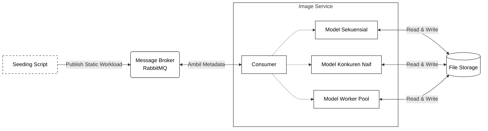

# Eksperimen Perbandingan Model Konkuren Go

Prototipe eksperimen evaluasi performa model pemrosesan gambar pada sistem portal berita

## Arsitektur Sistem



## Skenario yang Diuji

| Model | Deskripsi |
|-------|-----------|
| Sequential | Proses gambar satu per satu secara berurutan |
| Naive_Concurrent | Setiap gambar diproses dalam goroutine terpisah tanpa batasan |
| WorkerPool_4 | Goroutine dibatasi sejumlah 4 worker menggunakan pola worker pool |

## Dataset

Dataset diunduh dari **IMAGINE** (Image Analysis, Measurement, and Monitoring - Intelligent Eye)  
Sumber: https://kisi.pcz.pl/imagine/

**Spesifikasi:**
- Jumlah: 100 gambar JPEG
- Kamera: Nikon D5 (38), Nikon D810 (31), Nikon Z7 (31)
- Resolusi: bervariasi

**Cara download dataset:**
```bash
./download_dataset.sh
```

Script akan mengunduh 100 gambar ke folder `storage/uploads/`

## Cara Menjalankan

```bash
# download dataset terlebih dahulu
./download_dataset.sh

# jalankan eksperimen otomatis
./run_experiment.sh
```

## Hasil Eksperimen

Hasil eksperimen disimpan di `results/experiment_data.csv` dengan kolom:
- Timestamp
- Scenario
- Total_Images
- Duration_Sec
- CPU_Avg_Percent
- Peak_RAM_MB
- Num_Workers

## Teknologi

- Go 1.24
- libvips 8.15
- RabbitMQ 3.13
- Docker & Docker Compose
- Alpine Linux 3.19
